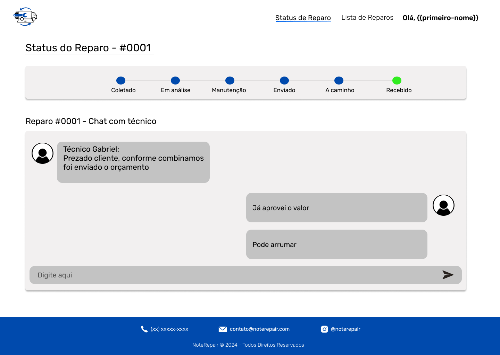

# Documento de Interface - NoteRepair

*NoteRepair* é uma plataforma desenvolvida para facilitar a interação entre clientes e técnicos de reparo de equipamentos, permitindo que gerentes, técnicos e clientes acompanhem e gerenciem reparos e orçamentos em tempo real. O sistema é estruturado de forma a atender aos requisitos funcionais e não funcionais descritos nas histórias de usuário.

Para o design das páginas, foi utilizado o [Figma](https://www.figma.com/), uma ferramenta robusta para a criação e prototipação de interfaces. O controle de versionamento das documentações e histórico de alterações foi gerenciado através do [Confluence](https://www.atlassian.com/software/confluence), uma plataforma que facilita a colaboração e o gerenciamento de projetos.

## User Flow

O *user flow* representa o caminho que cada tipo de usuário percorre dentro da plataforma *NoteRepair*. Ele está dividido em três principais categorias: Gerente, Cliente e Técnico, com cada um acessando funcionalidades específicas para suas necessidades.

### Gerente

O gerente tem o papel de supervisionar a equipe técnica, gerar relatórios e acompanhar o andamento dos pedidos de reparo. Ele pode:
- Cadastrar e gerenciar técnicos.
- Acompanhar a fila de pedidos de reparo e verificar as informações detalhadas de cada um.
- Gerar relatórios financeiros e de reparos.
- Controlar as permissões dos colaboradores.

### Cliente

O cliente utiliza a plataforma para acompanhar o status dos reparos solicitados e criar novas solicitações. As funcionalidades principais incluem:
- Visualizar a lista de reparos solicitados e acompanhar o status de cada um.
- Criar novas solicitações de reparo, fornecendo informações detalhadas sobre o equipamento.
- Comunicar-se com o técnico responsável pelo reparo através de um chat.

### Técnico

Os técnicos podem visualizar a fila de reparos e atualizar o status dos serviços. Suas principais responsabilidades são:
- Acessar a lista de reparos.
- Atualizar o status de um reparo específico (Em Análise, Manutenção, Enviado).
- Comunicar-se com os clientes via chat.

### Diagrama do User Flow

---

## Interface - Página Inicial do Gerente

Esta é a página inicial acessada pelo gerente. Ela contém diversas funcionalidades relacionadas ao gerenciamento de colaboradores, supervisão da fila de pedidos e emissão de relatórios. O gerente tem controle completo sobre os técnicos e pode visualizar o progresso de cada reparo.

- **Cadastro e Gerenciamento de Colaboradores:** O gerente pode adicionar novos técnicos e gerenciar suas permissões.
- **Permissões:** Controle sobre as permissões de cada colaborador.
- **Fila de Processamento de Pedidos:** O gerente pode visualizar todos os pedidos de reparo em andamento e acessar informações detalhadas sobre cada um.
- **Emissão de Relatórios:** O gerente pode gerar relatórios sobre finanças, reparos e transações, com opção de exportação em PDF ou XLS.

---

## Interface - Fila de Processamento de Pedidos

Esta página é acessada tanto pelos técnicos quanto pelos gerentes. Ela apresenta a lista de todos os pedidos de reparo em andamento, com detalhes como cliente, data de criação, status atual e o técnico responsável. A partir desta tela, o gerente ou o técnico pode editar o pedido ou acessar detalhes mais específicos.

- **Pedidos em Andamento:** Visualização dos pedidos com opções de filtragem e edição.
- **Ações Disponíveis:** Visualizar detalhes, editar ou mudar o status do reparo.

---

## Interface - Relatórios

A página de relatórios permite ao gerente gerar, visualizar e exportar relatórios detalhados sobre os processos de reparo, o desempenho financeiro da empresa e as transações realizadas. Há três tipos principais de relatórios que podem ser gerados: financeiros, de reparo e transações.

- **Tipos de Relatório:** Finanças, reparos, e transações.
- **Exportação:** PDF e XLS disponíveis para download.
- **Criação de Relatórios:** Formulário para criar novos relatórios com detalhes como status, responsável e tipo de relatório.

---

## Interface - Página Inicial do Cliente

Esta é a página de entrada do site, onde o cliente tem o primeiro contato com a plataforma. Aqui, o cliente pode realizar o login ou se cadastrar para ter acesso ao sistema e, posteriormente, criar novas solicitações e acompanhar seus reparos.

- **Login e Cadastro:** O cliente pode realizar o login caso já tenha uma conta, ou pode optar por se cadastrar fornecendo as informações necessárias.
- **Primeiro Contato com o Sistema:** Esta página oferece uma introdução básica sobre o serviço, valores e missão da empresa, além de informações de contato e localizações.

---

## Interface - Pedido de Orçamento

Nesta interface, o cliente pode solicitar um orçamento para o reparo do dispositivo. O formulário inclui campos para a marca, modelo e uma descrição do problema, além de endereços de coleta e entrega do equipamento.

- **Descrição do Problema:** O cliente deve fornecer detalhes sobre o defeito do dispositivo.
- **Endereços:** Campos para inserir o endereço de coleta e entrega.

---

## Interface - Chat do Cliente com Técnico

Essa funcionalidade permite que o cliente e o técnico se comuniquem diretamente. Através do chat, o cliente pode se comunicar com o técnico para eventuais duvidas em cada parte do processo.

- **Gráfico de Progresso:** Representação visual do status do reparo.
- **Comunicação Direta:** Chat em tempo real entre cliente e técnico.

---

## Interface - Detalhes do Reparo

Nesta página, os técnicos podem visualizar todos os detalhes de um pedido de reparo específico, incluindo informações do cliente, equipamento e endereço. Eles também podem atualizar o status do reparo e enviar relatórios ao gerente.

- **Informações Detalhadas:** Visualização do problema relatado, endereço e contato do cliente.
- **Atualização de Status:** Possibilidade de alterar o status do reparo.

---

## Interface - Chat do Técnico com Cliente

Essa funcionalidade permite que o técnico se comuniquem diretamente com o cliente. Através do chat, o técnico pode informar o progresso do reparo, negociar orçamentos e esclarecer dúvidas.

- **Gráfico de Progresso:** Representação visual do status do reparo.
- **Comunicação Direta:** Chat em tempo real entre cliente e técnico.
- **Atualização de Status:** O técnico pode atualizar o status do reparo diretamente da conversa.
- **Orçamento:** Detalhamento do valor estimado para o reparo.

---
