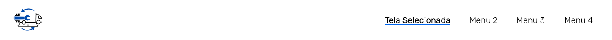
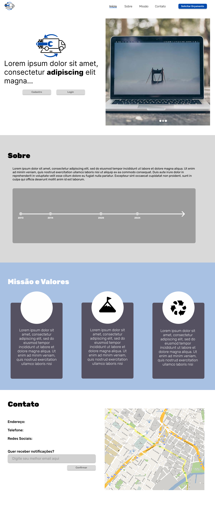
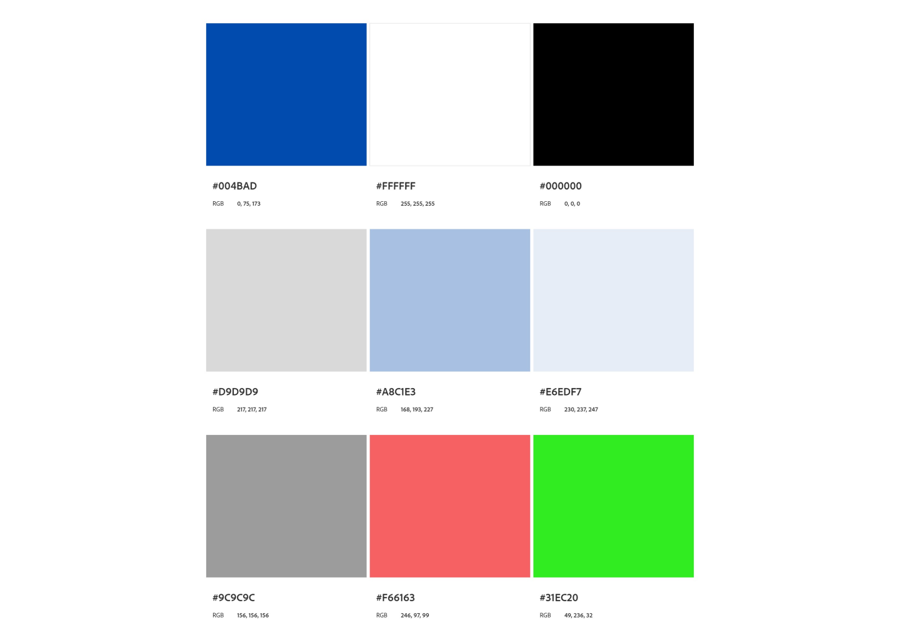
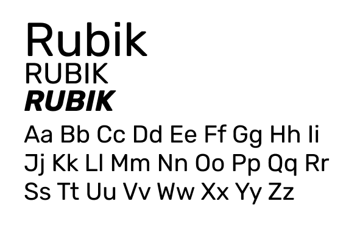
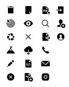

# Template padrão do site

A identidade visual da Noterepair, com um design clean e moderno, reflete a qualidade e a eficiência dos nossos serviços. As cores suaves e agradáveis criam um ambiente online mais convidativo, enquanto a organização intuitiva das informações agiliza a sua experiência. Com este template, buscamos oferecer uma plataforma mais completa e eficaz para atender às suas necessidades.

# Design

### Logo

### Cabeçalho

### Rodapé

### Página Inicial

### Cores

### Tipografia

### Iconografia
Utilizados icones presentes na biblioteca [Icons8](https://icons8.com/). Optamos pelo pacote IOS 17, que apresenta um visual moderno e minimalista.

